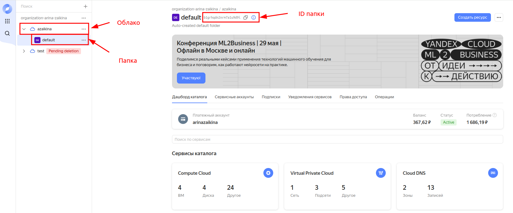
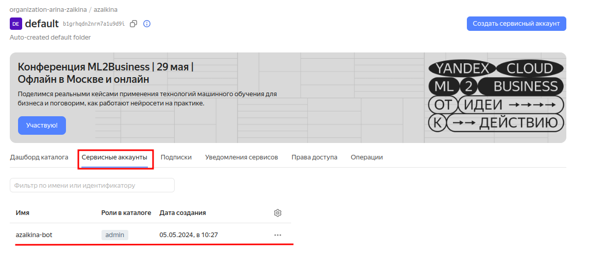
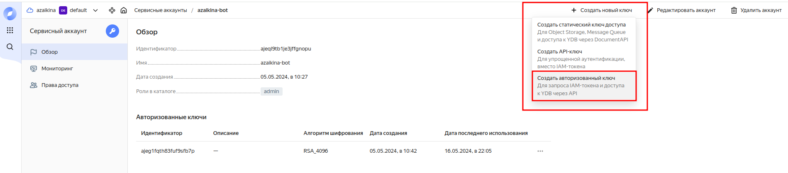

# VPN-инфраструктура

## Инструкция по запуску развертывания VPN-инфраструктуры в Yandex Cloud на ОС Linux Ubuntu

### Шаг 1. Подготовка аккаунта в Yandex Cloud

1. Создать аккаунт в Яндекс
2. Авторизоваться в Yandex Cloud с помощью аккаунта Яндекс
3. В Yandex Cloud создать платежный аккаунт
4. Создать облако.

- После создания в облаке в нем появляется папка по умолчанию default. У папки есть ID, он понадобится для создания
  виртуальных машин



5. Создать сервисный аккаунт



6. Получить авторизованный ключ

- Зайти в созданный сервисный аккаунт и создать авторизованный ключ



- Скачать файл с ключом
- В результате должен быть скачан файл `authorized_key.json`

7. Получить пароль приложения в Яндекс для использования их почтового сервера

- В разделе безопасности перейти на страницу паролей приложения и создать пароль для почты
- Скопировать и сохранить полученный пароль

### Шаг 2. Клонирование репозитория

1. Открыть терминал.
2. С помощью команды `cd` перейти в каталог, где будет размещён проект.
3. Выполнить команду для клонирования проекта:

```bash
git clone https://github.com/arinazaikina/vpn_infra.git
```

4. Перейти в каталог проекта

```bash
cd vpn_infra
```

### Шаг 3. Настройка окружения

1. Выполнить скрипт `setup_venv.sh`

```bash
./setup_venv.sh
```

2. В корневой директории проекта `vpn_infra` создать файл `.env`

```bash
touch .env
```

3. Открыть файл

```bash
nano .env
```

4. Записать в файл следующие переменные

```
AUTHORIZED_KEY_PATH=/путь/authorized_key.json
FOLDER_ID=
SSH_KEY_NAME=yandex_cloud_key
SSH_PRIVATE_KEY_PATH=/home/USER/.ssh/yandex_cloud_key
SSH_PUBLIC_KEY_PATH=/home/USER/.ssh/yandex_cloud_key.pub
YANDEX_EMAIL=
YANDEX_EMAIL_PASSWORD=
MONITORING_PASSWORD=
```

- AUTHORIZED_KEY_PATH: путь до файла, который был получен на шаге 1.6
- FOLDER_ID: ID папки по умолчанию в созданном облаке
- SSH_KEY_NAME: название ключа, который будет создан на управляющем узле для доступа к виртуальным машинам в облаке по
  ssh
- SSH_PRIVATE_KEY_PATH и SSH_PUBLIC_KEY_PATH: пути к публичному и приватному ключам
- YANDEX_EMAIL: почтовый адрес в Яндекс
- YANDEX_EMAIL_PASSWORD: пароль приложения, полученный на шаге 1.7
- MONITORING_PASSWORD: пароль для доступа к веб-интерфейсу Prometheus и Grafana

### Шаг 3. Конфигурирование виртуальных машин

В файле `instances_config.py` в корневой папке проекта можно задать параметры виртуальных машин.

Подробное описание всех параметров представлено в файле `Описание проекта.md`

### Шаг 4. Запуск разворачивания инфраструктуры

1. Выполнить скрипт `run.sh`

```bash
./run.sh
```

2. Дождаться выполнения скрипта

### Шаг 5. Получение конфигурации *.ovpn

1. В Yandex Cloud получить IP-адрес машины vpn
2. Зайти на машину vpn по ssh

```bash
ssh -i .ssh/имя_ключа пользователь@IP_адрес_машины_мзт
```
3. Для получения конфигурации на электронную почту выполнить команду

```bash
sudo make_config имя_пользователя_для_которого_предназаначена_конфигурация -m email
```

Можно получить конфигурацию без отправки на электронную почту.
В Этом случае надо выполнить команду:

```bash
sudo make_config имя_пользователя_для_которого_предназаначена_конфигурация
```

Конфигурация будет находиться по пути `"/home/пользователь/clients/files"`

### Шаг 6. Доступ к Prometheus

- https://<IP_машины_monitoring>:9090
- Авторизация: ваше имя на управляющем узле; пароль MONITORING_PASSWORD, задаваемый в файле `.env`

### Шаг 7. Доступ к Grafana

- https://<IP_машины_monitoring>:3000
- Авторизация: admin; пароль MONITORING_PASSWORD, задаваемый в файле `.env`
