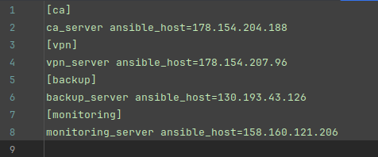

# Развёртывание VPN-инфраструктуры в Yandex Cloud

**Цель проекта**: создание стабильной и защищённой VPN-инфраструктуры для обеспечения безопасного удалённого доступа к
корпоративным ресурсам.

**Описание инфраструктуры** 
Проект включает в себя развёртывание четырёх виртуальных машин в Yandex Cloud для следующих целей:

- CA (Центр сертификации) - управление ключами и сертификатами для VPN;
- VPN сервер - обеспечение зашифрованного подключения к сети;
- Мониторинг - отслеживание состояния VPN-сервера и связанных с ним сервисов.
- Backup - резервное копирование важных данных.

**Технологический стек**

- Язык программирования: Python
- Yandex Cloud API
- Ansible для автоматизации задач
- Git для контроля версий
- Операционные системы: Ubuntu 22.04

**Процесс развёртывания**

1. **Создание виртуальных машин** 
   Виртуальные машины создаются в YandexCloud автоматически с помощью python-скрипта согласно предопределённой
   конфигурации,
   которая включает в себя параметры машины, такие как количество ядер, объём памяти и размер диска.
   Весь процесс ускоряется за счёт использования многопоточности. 

2. **Создание расписания снимков дисков в YandexCloud** 
   Автоматически создается расписание снимков дисков каждой машины, что позволяет обеспечить сохранность данных в случае
   сбоев или атак.

3. **Конфигурация систем** 
   С помощью Ansible автоматически запускается процесс установки и настройки необходимого программного обеспечения на
   машинах, что минимизирует возможность человеческой ошибки и гарантирует быструю и последовательную настройку всех
   машин.

## Создание виртуальных машин в YandexCloud

### Переменные окружения

До начала создания виртуальных машин в YandexCloud и их настройки, необходимо задать переменные окружения в
файле `.env`.

1. `USER`  
   **Описание**: имя пользователя, под которым будет выполняться авторизация на виртуальных машинах. 
   **Использование**: используется при настройке SSH-доступа и в Ansible для выполнения команд под данным
   пользователем.  

2. `AUTHORIZED_KEY_PATH`  
   **Описание**: путь к файлу JSON, содержащему ключи доступа для API Yandex Cloud. Этот файл используется для
   аутентификации запросов к Yandex Cloud API. 
   **Использование**: необходим для настройки SSH-доступа к машинам. Файл ключей используется для авторизации при
   выполнении операций через API.  

3. `FOLDER_ID` 
   **Описание**: идентификатор папки в Yandex Cloud, где будут создаваться виртуальные машины. 
   **Использование**: используется для указания рабочей области в Yandex Cloud API.  

4. `SSH_KEY_NAME` 
   **Описание**: имя SSH ключа. 
   **Использование**: используется для идентификации приватного и публичного ключей.  

5. `SSH_PRIVATE_KEY_PATH` и `SSH_PUBLIC_KEY_PATH` 
   **Описание**: пути к файлам приватного и публичного SSH-ключей. 
   **Использование**: приватный ключ используется для установления защищенного соединения управляющего компьютера с
   машинами в YandexCloud,
   публичный ключ записывается в их конфигурацию для обеспечения доступа.  

6. `YANDEX_EMAIL` 
   **Описание**: адрес электронной почты Yandex. 
   **Использование**: отправка электронных писем через SMTP сервер Yandex.  

7. `YANDEX_EMAIL_PASSWORD` 
   **Описание**: специальный пароль приложения, созданный в настройках учетной записи Yandex для использования в
   автоматизированных системах,
   отличный от основного пароля пользователя. 
   **Использование**: аутентификация при подключении к SMTP серверу Yandex для отправки электронных писем без
   использования основного пароля пользователя. Это повышает безопасность,
   так как специальный пароль можно отозвать в любой момент без изменения основного пароля.  

8. `MONITORING_PASSWORD` 
   **Описание**: пароль для доступа к системам мониторинга, устанавливаемым на машинах. 
   **Использование**: используется при настройке мониторинга для обеспечения безопасного доступа к интерфейсам
   мониторинга.

Переменные окружения загружаются в начале выполнения скрипта с помощью функции `load_dotenv()` из библиотеки `dotenv`.
Это позволяет изолировать чувствительные данные от кода и легко изменять параметры без необходимости изменения самого
кода.
Загруженные переменные используются по всему скрипту для конфигурации и авторизации, обеспечивая необходимую гибкость и
безопасность.

### SSH-ключ на управляющем компьютере

Для безопасного подключения управляющего компьютера к виртуальным машинам в YandexCloud необходимо сгенерировать новую
пару
SSH ключей (приватного и публичного).  
Создание ключей осуществляется с помощью метода `create_ssh_key` в классе `SSHKeys`.  
Метод сначала проверяет, существует ли приватный ключ по пути `~/.ssh/ИМЯ_КЛЮЧА.pub`. Имя ключа задается в файле `.env`.
Если файл ключа уже присутствует, функция уведомляет пользователя о том, что использование существующего ключа будет
продолжено, и новый ключ создаваться не будет.
Это предотвращает случайное перезаписывание уже используемых ключей.  

Если файл приватного ключа отсутствует, метод выполняет команду `ssh-keygen`.
При вызове `ssh-keygen` используются следующие параметры:

- `-t rsa`: указывает тип ключа RSA, который является общепринятым стандартом для SSH ключей.
- `-b 4096`: задаёт длину ключа в 4096 бит, что обеспечивает высокий уровень безопасности.
- `-f </путь/до/приватного/ключа>`: указывает путь, по которому будет сохранён новый приватный ключ.
- `-N ''`: создаёт ключ без парольной фразы для упрощения автоматизации, не требуя ввода пароля при каждом
  использовании.
- `-q`: запускает команду в тихом режиме, уменьшая количество выводимых на экран сообщений.

После выполнения команды пользователю сообщается о создании нового ключа.

### Файл конфигурации виртуальных машин

Конфигурация виртуальных машин находится в файле `instances_config.py` в корневой папке проекта.
В файле конфигурации находится список словарей. Каждый словарь в этом списке содержит параметры для создания одной
виртуальной машины в Yandex Cloud.
В данной конфигурации определено четыре виртуальные машины, каждая из которых имеет уникальную роль и настройки.

**1. CA (Центр сертификации)**

- Особенности: машина, предназначенная для управления ключами и сертификатами для VPN.
- Параметры: 2 ядра CPU, 1 ГБ оперативной памяти, 10 ГБ дискового пространства.
- ОС: Ubuntu 22.04 с OsLogin.

**2. VPN сервер**

- Особенности: сервер для обеспечения зашифрованного доступа к корпоративной сети.
- Параметры: 2 ядра CPU, 1 ГБ оперативной памяти, 10 ГБ дискового пространства.
- ОС: Ubuntu 22.04 с OsLogin.

**3. Мониторинг**

- Особенности: машина для мониторинга состояния машин в инфраструктуре VPN.
- Параметры: 2 ядра CPU, 1 ГБ оперативной памяти, 10 ГБ дискового пространства.
- ОС: Ubuntu 22.04 с OsLogin.

**4. Backup (Резервное копирование)**

- Особенности: сервер для резервного копирования данных с машин CA и VPN.
- Параметры: 2 ядра CPU, 1 ГБ оперативной памяти, 10 ГБ дискового пространства.
- ОС: Ubuntu 22.04 с OsLogin.
- Расположена в другой зоне доступности для обеспечения георезервирования.

Каждая машина настроена для выполнения специфических задач, обеспечивающих безопасность и стабильность работы VPN-сети.

**Параметры конфигурации:**

- `name`: имя машины, используется для идентификации в облаке.
- `core_fraction`: процентное выражение загрузки ядра CPU.
- `cores`: количество ядер процессора.
- `memory`: объем оперативной памяти.
- `disk_size`: объем дискового пространства.
- `os`: версия операционной системы.
- `username`: имя пользователя для доступа.
- `zone_id`: зона доступности.
- `platform_id`: идентификатор платформы в Yandex Cloud.

Подробное описание параметров можно прочитать
в [документации](https://yandex.cloud/ru/docs/compute/api-ref/Instance/create).

### Процесс создания виртуальных машин

Для параллельного создания машин используется `ThreadPoolExecutor` из модуля `concurrent.futures`.
Этот подход позволяет одновременно запустить процессы создания нескольких виртуальных машин,
что значительно ускоряет общее время развертывания инфраструктуры.

**1. Инициализация Executor'а**
Используя контекстный менеджер, `ThreadPoolExecutor` инициализируется как `executor`.
Это создает пул потоков, в котором будут выполняться задачи по созданию виртуальных машин.

**2. Отправка задач на выполнение**
Для каждой машины из `INSTANCES_CONFIG` скрипт отправляет задачу на создание виртуальной машины в пул потоков.
Метод `executor.submit()` вызывается с параметрами каждой виртуальной машины (имя, конфигурация ядер, память, размер
диска, ОС, имя пользователя, зона доступности и идентификатор платформы).
Задачи ассоциируются с именами машин для дальнейшей идентификации.

**3. Обработка результатов выполнения**
По мере завершения задач `concurrent.futures.as_completed(future_to_instance)` обеспечивает итерацию по результатам
каждой операции.
Если задача выполнена успешно, скрипт извлекает IP-адрес из результата и сохраняет его в словарь `instance_data`,
регистрируя успех создания машины и её адрес.
В случае ошибок в процессе создания машины, скрипт выводит, возникшие исключения.

По завершении всех операций скрипт выводит итоговый список IP-адресов виртуальных машин.

Непосредственное создание виртуальных машин осуществляется с помощью YandexCloud API.
За настройку и запуск виртуальной машины в YandexCloud отвечает метод `setup_instance` класса `Instances`.
Он выполняет следующие ключевые шаги:

**1. Проверка существования машины** 
Метод сначала проверяет, существует ли уже машина с указанным именем (name).
Это делается вызовом метода `get_instance_by_name`.
Если машина существует, метод извлекает и возвращает IP-адрес этой машины, предотвращая попытку создание дубликата.

**2. Создание новой машины** 
Если машина с указанным именем не найдена, метод вызывает `create_instance`, передавая все необходимые параметры,
такие как количество ядер (cores), объем памяти (memory), размер диска (disk_size), операционную систему (os) и другие.

Для безопасного доступа к создаваемой машине, метод `create_instance` сначала читает публичный SSH ключ с управляющей
машины
с помощью вызова `SSHKeys().read_public_key()`. Далее создается строка конфигурации пользовательских данных.
Создается строка конфигурации в формате #cloud-config, которая указывает имя пользователя, его права, используемую
оболочку и авторизованные SSH ключи.
Это обеспечивает предварительную настройку пользователя при первом запуске машины, включая права суперпользователя без
запроса пароля.

Также метод `create_instance` определяет идентификатор подсети (subnet_id), который соответствует зоне,
указанной в параметрах (zone_id), с использованием `Subnets().get_subnet_id_by_zone(zone_id)`.

Далее метод `create_instance` выбирает идентификатор образа операционной системы (image_id)
с учетом требований к размеру диска и описания ОС.

Формируется сложный JSON-объект payload, который содержит все необходимые параметры для создания машины,
включая идентификатор папки, спецификации сетевых интерфейсов, ресурсов, дисков и пользовательские метаданные.
В метаданные включается не только пользовательская конфигурация, но и данные для SSH доступа, что обеспечивает
возможность удаленного управления машиной.

Запрос отправляется через API клиент (self.session.post), который обращается к endpoint Yandex Cloud для создания
инстанса.
По ответу API метод извлекает и возвращает идентификатор созданной машины (instance_id), который может быть использован
для дальнейшего управления машиной или получения ее статуса.

**3. Ожидание запуска машины** 
После создания машины вызывается метод `wait_for_instance_running`, который циклически проверяет статус машины до тех
пор,
пока она не перейдет в состояние "RUNNING". Этот метод также отвечает за получение и возврат IP-адреса запущенной
машины.

**4. Обработка исключений** 
Если в процессе создания или ожидания запуска машины возникают ошибки, метод генерирует исключение с соответствующим
сообщением об ошибке.

### Создание файла инвентаря для Ansible

После успешного создания виртуальных машин, следующий важный шаг в развертывании инфраструктуры - создание файла
инвентаря для Ansible.
Этот файл используется для управления конфигурациями и автоматизации задач на виртуальных машинах.
Файл инвентаря Ansible (`ansible/inventory/hosts`) содержит информацию о всех узлах (виртуальных машинах),
которыми управляет Ansible. В нем указываются IP-адреса машин, что позволяет Ansible корректно идентифицировать и
управлять каждым узлом в сети.

**Процесс создания файла:**

1. Функция `create_instance` возвращает словарь `instance_ips`, содержащий имена и IP-адреса созданных машин.
2. Функция `write_inventory`, в которую передаются данные созданных машин, инициирует путь к директории инвентаря,
   используя переменную
   `PROJECT_ROOT`, которая указывает на корневую директорию проекта.
3. С помощью `os.makedirs(inventory_path, exist_ok=True)` проверяется существование директории. Если директорию
   отсутствует,
   то происходит ее создание.
4. В файл hosts в директории инвентаря записываются имена и IP-адреса в формате, который Ansible может интерпретировать
   для выполнения операций.
   После записи данных в файл, функция выводит путь к файлу `hosts`.

Файл `hosts` не сохраняется в удаленном репозитории. Для этого в файл `.gitignore` добавляется соответствующая запись,
исключающая файл `hosts`.

_Файл инвентаря `hosts`_

### Создание расписания снимков дисков в Yandex Cloud

После развертывания виртуальных машин следующий этап - настройка автоматического создания снимков их дисков.
Снимки дисков (snapshots) позволяют восстановить состояние виртуальной машины на момент создания снимка,
что критически важно для восстановления после сбоев или атак.

**Процесс настройки включает несколько ключевых шагов:**

1. Определение необходимых дисков. 
   Из конфигурации INSTANCES_CONFIG собирается список всех виртуальных машин, для которых нужно создать расписание
   снимков.
   Для каждой машины по её идентификатору находятся связанные с ней диски, используя API запросы к Yandex Cloud.
2. Формирование списка дисков для снимков. 
   Полученные идентификаторы дисков собираются в список, который будет использоваться для создания расписания снимков.
3. Создание расписания снимков. 
   Для создания расписания снимков используется функция `create_snapshot_schedule`, которая настраивает параметры
   расписания:

- name и description - название и описание расписания, чтобы его можно было легко идентифицировать.
- schedule_expression - выражение cron, определяющее частоту создания снимков (например, ежедневно в полночь).
- max_snapshots_to_keep - максимальное количество снимков, которые нужно хранить, чтобы избежать излишнего использования
  дискового пространства.

4. Активация расписания. 
   После создания расписания необходимо убедиться, что оно активировано.
   Выполняется периодическая проверка статуса расписания до момента, когда оно перейдет в состояние "ACTIVE".

В случае возникновения проблем при создании или активации расписания, программа выведет сообщение об ошибке.

## Настройка виртуальных машин

Для автоматизации настройки виртуальных машин в проекте используется Ansible.
Этот инструмент позволяет автоматически устанавливать необходимое программное обеспечение и настраивать системы,
гарантируя, что все машины настроены правильно и единообразно. Это значительно упрощает процесс управления
серверами и сокращает время, необходимое на ручную настройку.

Для завершения процессов создания машин и обеспечения того, чтобы все машины были полностью доступны для управления
через Ansible
в скрипте предусмотрен 60-секундный интервал ожидания.
После паузы в 60 секунд после создания машин и расписания снимков скрипт выполняет функцию `run_ansible()`, которая
запускает Ansible playbook.
Этот playbook содержит ряд задач, которые настраивают машины, устанавливают необходимое программное обеспечение и
конфигурируют сервисы в соответствии с требованиями проекта.

**Ключевые аспекты функции `run_ansible()`:**

1. Передача переменных. 
   В функцию включен список `extra_vars`, который содержит переменные, необходимые для работы playbook.
   Эти переменные считываются из файла `.env` и передаются непосредственно в Ansible через командную строку.
   Переменные включают:

- `ansible_ssh_user`: имя пользователя для SSH доступа.
- `ansible_ssh_private_key_file` и `ansible_ssh_public_key_file`: пути к приватному и публичному ключам SSH.
- `local_host_ip`: IP-адрес управляющего узла.
- `yandex_email` и `yandex_email_password`: данные для доступа к почтовому серверу Yandex.
- `monitoring_password`: пароль для системы мониторинга, который может потребоваться для настройки соответствующих
  сервисов.

2. Формирование строки переменных. 
   Переменные формируются в строку `extra_vars_string` с использованием функции `shlex.quote`,
   которая обеспечивает корректное экранирование специальных символов в UNIX/Linux системах.
   Это предотвращает потенциальные проблемы при интерпретации аргументов командной строки.

3. Запуск playbook. 
   Скрипт использует `subprocess.run` для запуска команды ansible-playbook, передавая путь к playbook файлу (
   playbook.yml)
   и сформированную строку переменных.
   Использование ключа check=True гарантирует, что в случае возникновения ошибки в процессе выполнения playbook,
   скрипт завершится с исключением, что позволяет быстро реагировать на возникшие проблемы.

### Файл конфигурации Ansible `ansible.cfg`

`ansible.cfg` - конфигурационный файл, который настраивает основные параметры Ansible.

`[defaults]` - основная секция для установки стандартных настроек Ansible.

1. `inventory = ansible/inventory` - путь к файлу инвентаря, указывающему на хосты для управления.
2. `roles_path = ansible/roles` - директория, где Ansible будет искать роли. Роли Ansible - это предварительно
   заданные блоки задач, которые можно повторно использовать для автоматизации задач на разных хостах.
3. `host_key_checking = false` - отключение проверки SSH ключей хоста для упрощения первого подключения.
4. `nocows = 1` - отключение пасхалки Ansible, которая показывает сообщения с ASCII-графикой коровы, если на компьютере
   установлены соответствующие программы (например, cowsay).

### Директория `inventory` в Ansible

Директория `inventory` является центральным хранилищем для управления информацией о хостах, которыми Ansible должен
управлять. В этой директории содержатся файлы, определяющие хосты и группы хостов, а также их переменные. Она играет
важную роль в структурировании и организации всех управляемых серверов, что позволяет Ansible понимать,
какие действия и на каких хостах нужно выполнять.

**Ключевые компоненты директории `inventory`:**

1. Файл `hosts`. 
   Это основной файл инвентаря, где перечислены все хосты и группы хостов.
   В нем указываются IP-адреса или имена хостов, которые Ansible будет использовать для подключения и выполнения задач.
   В проекте этот файл создается автоматически в процессе создания виртуальных машин в YandexCloud с помощью
   python-скрипта.
2. Директория `group_vars`. 
   Содержит файлы переменных, которые применяются к различным группам хостов.
   Один из таких файлов - `all.yml`, который
   включает переменные, применяемые ко всем хостам.
   В этих файлах определяются параметры, такие как настройки сетевых портов, конфигурации SSH, пути к файлам и
   директориям, а также специфичные настройки для определенных приложений или сервисов.

### Директория `playbooks` в Ansible

Директория `playbooks` в структуре Ansible содержит playbook-файлы - основные исполняемые сценарии, которые описывают,
какие задачи Ansible должен выполнить на одном или нескольких хостах. Эти файлы организуют и документируют процессы
автоматизации, делая их воспроизводимыми и легко настраиваемыми.

Файл `playbools/playbook.yml` описывает серию заданий, разделенных на различные сцены, каждая из которых нацелена на
определенные группы хостов. 
Общее описание playbook:

**1. Основные настройки всех машин. **
Роли: [`disable_unattended_upgrades`](#отключение-автоматических-обновлений-роль-disable_unattended_upgrades),
[`ssh`](#ssh-ключ-на-управляющем-компьютере), [`timezone`](#установка-временной-зоны-роль-timezone),
[`disable_ipv6`](#отключение-ipv6-роль-disable_ipv6), [`firewall`](#настройка-файервола-роль-firewall),
[`custom_repo`](#добавление-пользовательского-репозитория-custom_repo). 
Описание: отключение автоматических обновлений, настройка SSH, установка временной зоны, отключение IPv6, настройка
файервола и добавление пользовательских репозиториев.

**2. Настройка сервера CA. **
Роли: [`package_install (ca)`](#управление-пакетами-роль-package_install). 
Описание: установка необходимого ПО для работы сервера сертификации.

**3. Настройка VPN сервера.** 
Роли: [`vpn_firewall`](#настройка-файервола-для-vpn-сервера-роль-vpn_firewall),
[`msmtp`](#настройка-почтового-клиента-роль-msmtp), [`vpn_configurator`](#конфигурация-vpn-роль-vpn_configurator),
[`package_install (vpn)`](#управление-пакетами-роль-package_install),
[`openvpn_exporter`](#настройка-экспортера-openvpn-для-мониторинга-роль-openvpn_exporter). 
Описание: настройка файервола для VPN, настройка почтового клиента, конфигурация VPN, установка VPN-пакета, настройка
экспортера OpenVPN для мониторинга.

**4. Установка Node Exporter на всех машинах.** 
Роли: [`node_exporter`](#сбор-метрик-с-серверов-для-мониторинга-производительности-роль-node_exporter). 
Описание: сбор метрик с серверов для мониторинга производительности.

**5. Настройка мониторинга.** 
Роли: [`prometheus`](#установка-и-настройка-prometheus-и-alertmanager-роль-prometheus),
[`grafana`](#установка-и-настройка-grafana-для-визуализации-данных-мониторинга). 
Описание: установка и настройка Prometheus для сбора метрик и Grafana для визуализации данных мониторинга.

**6. Настройка сервера резервного копирования. **
Роли: [`msmtp`](#настройка-почтового-клиента-роль-msmtp), [`backup_script`](#настройка-резервного-копирования). 
Описание: настройка почтового клиента и скриптов резервного копирования.

Ниже будет представлено детальное описание каждой роли, которое поможет лучше понять, как каждый аспект инфраструктуры
управляется и настраивается через Ansible.

### Описание ролей

Каждая роль в Ansible отвечает за определенный набор задач и конфигураций. 
Каждая роль содержит несколько каталогов:

- `tasks`: задачи, которые нужно выполнить.
- `handlers`: обработчики, которые срабатывают на определенные события.
- `templates`: шаблоны файлов конфигурации.
- `vars`: переменные, специфичные для роли.
- `files`: статические файлы, которые могут быть развернуты на целевых машинах.
- `defaults`: значения переменных по умолчанию.

### Отключение автоматических обновлений (роль `disable_unattended_upgrades`)

Роль `disable_unattended_upgrades` отвечает за управление автоматическими обновлениями на системах Debian и Ubuntu. Она
выполняет три основные функции:

**1. Установка `unattended-upgrades`** 
Роль проверяет и обеспечивает установку пакета `unattended-upgrades`, чтобы возможность автоматического
обновления была доступна.

**2. Конфигурация автоматических обновлений** 
Роль настраивает поведение `unattended-upgrades` через шаблон конфигурации.
Этот шаблон указывает системе не выполнять
автоматические обновления пакетов. Конфигурация записывается в файл `/etc/apt/apt.conf.d/20auto-upgrades`, и после
изменения конфигурации инициируется команда остановки сервиса `unattended-upgrades`.

**3. Отключение сервиса unattended-upgrades** 
Наконец, роль полностью отключает и останавливает сервис `unattended-upgrades`, чтобы предотвратить любые автоматические
обновления в будущем. Это делается для того, чтобы администратор мог контролировать процесс обновления и применять
обновления вручную, когда это будет необходимо, обеспечивая таким образом, что обновления не приведут к непредвиденным
сбоям или конфликтам.

### Настройка SSH (роль `ssh`)

Роль `ssh` организована для настройки SSH на всех узлах системы. Она включает в себя обновление пакетов, установку и
настройку SSH, управление ключами и создание специализированных конфигурационных файлов для SSH. Ниже представлено более
подробное описание каждой задачи в этой роли.

**1. Обновление пакетов.** 
Роль начинается с обновления кеша пакетов, чтобы убедиться, что все последующие операции с пакетами будут использовать
самую последнюю информацию.

**2. Установка необходимых пакетов для SSH. **
Устанавливается `openssh-server`, обеспечивая наличие SSH сервера на хостах для удалённого управления.

**3. Очистка файла `known_hosts`.**
Удаляются старые записи из файла `known_hosts`, что помогает избежать конфликтов из-за изменений в ключах хостов.

**4. Генерация SSH ключа. **
Создается новая пара SSH ключей для безопасного доступа к хостам без использования паролей.

**5. Извлечение публичного ключа на управляющий узел. **
Публичный ключ с каждого узла копируется на управляющий узел для последующего распространения по другим хостам.

**6. Копирование публичных ключей в authorized_keys всех хостов. **
Публичные ключи всех узлов добавляются в файл `authorized_keys` друг друга, что позволяет осуществлять доступ без
паролей
между хостами.

**7. Очистка временных файлов публичных ключей на управляющем узле .**
Временные файлы с публичными ключами удаляются с управляющего узла после их распространения.

**8. Установка прав доступа для SSH ключей. **
Настройка прав доступа к приватным ключам на хостах устанавливает их владельца и группу, а также права доступа только
для владельца (0600), что предотвращает несанкционированный доступ к ключам.

**9. Добавление отпечатков ключей хостов в known_hosts. **
Задача добавляет отпечатки публичных ключей всех хостов в файл known_hosts для каждого узла, что позволяет SSH-клиенту
автоматически доверять хостам при подключении.

**10. Настройка файла конфигурации SSH. **
Используя шаблоны, создаются конфигурационные файлы SSH на каждом узле.
Эти файлы настраивают такие параметры, как отключение проверки подлинности хоста и использование публичного ключа для
аутентификации, что упрощает управление подключениями и повышает их безопасность.

### Установка временной зоны (роль `timezone`)

Роль `timezone` настраивает часовой пояс на целевых хостах. 
Основные задачи роли:

**1. Установка часового пояса.  **
С помощью команды `timedatectl` роль устанавливает нужный часовой пояс, который по дефолту определяется как
Europe/Moscow.

**2. Перезагрузка сервиса времени. **
Чтобы изменения вступили в силу, необходимо перезапустить службу синхронизации времени `systemd-timesyncd.service`. Это
гарантирует, что сервер моментально перейдет на новый часовой пояс.

**3. Проверка настроек времени. **
Роль выполняет команду `timedatectl`, чтобы увидеть текущие настройки времени и убедиться, что часовой пояс установлен
правильно. Результаты проверки времени выводятся на экран для информации.

### Отключение IPv6 (роль `disable_ipv6`)

Роль `disable_ipv6` предназначена для отключения IPv6 на всех интерфейсах сервера и применения изменений в настройках
ядра без необходимости перезагрузки системы.

**1. Отключение IPv6 на всех сетевых интерфейсах. **
Эта задача добавляет конфигурационную строку в системный файл `/etc/sysctl.conf`,
который контролирует настройки сетевого стека ОС. Строка `net.ipv6.conf.all.disable_ipv6 = 1` устанавливает, что IPv6
должен быть отключен на всех интерфейсах.

**2. Отключение IPv6 на локальных (по умолчанию создаваемых) интерфейсах. **
Похоже на предыдущую задачу, но вместо общей настройки на всех интерфейсах, строка `net.ipv6.conf.default.disable_ipv6 =
1` применяется к настройкам по умолчанию, что влияет на все новые интерфейсы, которые будут созданы в будущем.
Это также выполняется с повышенными привилегиями и создает запись в том же системном файле.

**3. Применение настроек ядра без перезагрузки. **
После внесения изменений в файл конфигурации, задача использует команду `sysctl -p` для применения изменений на лету,
без необходимости перезагружать систему. Это позволяет изменениям вступить в силу немедленно.

### Настройка файервола (роль `firewall`)

Эта роль Ansible организует комплексную настройку брандмауэра с использованием iptables, включая установку необходимых
пакетов, создание структуры директорий, настройку правил и сохранение конфигурации. Ниже представлено детальное описание
каждой из задач, выполняемых в рамках этой роли.

**1. Установка пакета `iptables-persistent`. **
Пакет iptables-persistent устанавливается для сохранения настроек iptables при перезагрузках системы. Используется
модуль apt для установки, с указанием, что процесс установки должен проходить в неинтерактивном режиме (DEBIAN_FRONTEND:
noninteractive).

**2. Создание директории для конфигураций iptables. **
Если указанная директория для файлов конфигурации iptables не существует, она создается с необходимыми правами доступа
(0755), что обеспечивает возможность чтения и исполнения всеми пользователями и запись владельцем.

**3. Очистка цепочек и таблиц. **
Очищаются основные цепочки (INPUT, FORWARD, OUTPUT) в таблице filter, а также таблицы nat и mangle, что удаляет все
существующие правила и обеспечивает "чистый лист" для настройки новых правил.

**4. Разрешение SSH доступа для текущего хоста. **
Это правило позволяет SSH-соединения (протокол TCP) на порт, указанный в переменной `network_ports.ssh` (22), с
IP-адреса управляющего хоста. Это обеспечивает возможность управления сервером через SSH с известного
и безопасного источника.

**5. Разрешение установленных и связанных соединений. **
Правило позволяет входящий трафик для уже установленных (ESTABLISHED) или связанных (RELATED) сетевых соединений. Это
важно для нормальной работы многих приложений, включая веб-серверы и базы данных, которые требуют многократных
соединений с одного источника.

**6. Разрешение локального трафика на интерфейсе lo. **
Локальный трафик на интерфейсе lo (localhost) разрешен, что критично для множества внутренних процессов и приложений,
которые взаимодействуют через этот интерфейс.

**7. Разрешение SSH доступа для всех хостов в инвентаре. **
Это правило позволяет SSH-соединения для всех хостов, определенных в инвентаре Ansible, что облегчает управление и
мониторинг сети.

**8. Разрешение доступа к Prometheus и Grafana. **
Специфические правила для каждого из этих приложений разрешают входящий трафик на соответствующие порты
(`network_ports.prometheus` (9090) и `network_ports.grafana` (3000)) только с сервера мониторинга.
Это гарантирует, что доступ к инструментам мониторинга ограничен и контролируем.

**9. Политики по умолчанию для цепочек INPUT, FORWARD, OUTPUT. **

- Для цепочки INPUT и FORWARD устанавливается политика DROP, что означает блокировку всего входящего и проходящего
  трафика, если он не соответствует разрешающим правилам. Это повышает безопасность, предотвращая несанкционированный
  доступ.
- Для цепочки OUTPUT устанавливается политика ACCEPT, разрешая весь исходящий трафик, что обычно безопасно для
  контролируемых серверных сред.

**10. Сохранение настроек iptables. **
ля сохранения настроек iptables после перезагрузки системы используется включение задач из внешнего файла (
iptables_save.yml), который содержит команды для сохранения текущих настроек в файле системы.

### Добавление пользовательского репозитория (`custom_repo`)

На машину удостоверяющего центра устанавливается пакет `ca`. На VPN-сервер устанавливается пакет `vpn`.
Оба этих пакета хранятся в пользовательском репозитории https://arinazaikina.github.io/azaikina-deb-repo/.

Роль `custom_repo` описывает процесс добавления этого APT репозитория в систему на основе Debian или Ubuntu. Роль
включает в себя загрузку GPG-ключа репозитория, его подготовку к использованию, добавление самого репозитория,
обновление списка пакетов.

Подробное описание процесса подготовки и хранения пакетов `ca` и `vpn` в пользовательском репозитории будет описано
в соответствующем разделе, а на данный момент ниже представлено описание каждой задачи в роли `custom_repo`.

**1. Загрузка GPG-ключа репозитория. **
Используя модуль `get_url`, загружается GPG-ключ с
URL https://raw.githubusercontent.com/arinazaikina/azaikina-deb-repo/main/repo-key.gpg. Ключ сохраняется во временный
файл в директории `/tmp/`.

**2. Деарморирование и сохранение GPG-ключа. **
С помощью команды `gpg --dearmor` ключ преобразуется из арморированной (текстовой) формы в бинарный формат и сохраняется
по указанному пути `/usr/share/keyrings/azaikina-deb-repo.gpg`.

**3. Добавление APT репозитория. **
Модуль `apt_repository` используется для добавления нового репозитория в список источников APT. Репозиторий описывается
строкой `deb [signed-by=/usr/share/keyrings/azaikina-deb-repo.gpg] https://arinazaikina.github.io/azaikina-deb-repo/ /`,
которая указывает на URL репозитория и путь к GPG-ключу для проверки подписей.

**4. Обновление списка пакетов. **
После добавления репозитория список доступных пакетов обновляется с использованием модуля apt.

**5. Удаление временного файла ключа. **
После всех операций временный файл с GPG-ключом удаляется с управляющего хоста для предотвращения его непреднамеренного
использования или доступа.

### Управление пакетами (роль `package_install`)

Роль `package_install` предназначена для управления пакетами в системах на базе Debian или Ubuntu. Она включает
обновление кэша пакетов и установку конкретного пакета.

**1. Обновление списка пакетов. **
Используя модуль apt, выполняется обновление кэша пакетов, чтобы убедиться, что все последующие операции с пакетами
будут использовать актуальные данные из репозиториев.

**2. Установка пакета. **
Установка заданного пакета с использованием того же модуля apt.

### Настройка файервола для VPN-сервера (роль `vpn_firewall`)

Эта роль Ansible предназначена для настройки правил брандмауэра iptables для VPN сервера. Она включает определение
основного сетевого интерфейса, настройку правил для разрешения VPN трафика, и конфигурацию NAT для клиентов VPN.
Рассмотрим каждую задачу более подробно.

**1. Определение основного сетевого интерфейса. **
С помощью модуля `set_fact`, определяется переменная `main_interface`, которая использует значение интерфейса,
полученное через `ansible_default_ipv4.interface`.

**2. Разрешение входящих соединений для VPN. **
Настраиваются правила iptables для разрешения UDP трафика на порту 1194 через
основной интерфейс. Правило применяется только для новых соединений (NEW).

**3. Разрешение входящих соединений на интерфейсе tun+. **
Разрешает весь входящий трафик на интерфейсе tun+, который обычно используется для VPN туннелей.

**4. Разрешение трафика через интерфейс tun+. **
Настраивает правила для пропуска трафика через интерфейс tun+. Это касается трафика, идущего через VPN туннель.

**5. Разрешение ответного трафика на интерфейсе tun+ и основном интерфейсе. **
Настраиваются правила для разрешения трафика, который идет в ответ на уже установленные или связанные соединения (
RELATED, ESTABLISHED). Это обеспечивает нормальное функционирование сессий, инициированных через VPN.

**6. Настройка NAT для клиентов VPN. **
Устанавливается правило для маскарадинга (скрытия) IP-адресов клиентов VPN при выходе в интернет через основной
интерфейс. Это позволяет клиентам VPN использовать IP-адрес сервера для доступа к сети.

**7. Сохранение настроек iptables. **
Для обеспечения сохранения всех настроенных правил iptables после перезагрузки сервера, выполняется включение
дополнительных задач из файла `iptables_save.yml`.

### Настройка почтового клиента (роль `msmtp`)

Роль `msmtp` предназначена для установки и настройки msmtp, утилиты для отправки электронной почты, а также для
проверки функциональности отправки почты. Она включает установку пакета, настройку конфигурационного файла и
тестирование отправки тестового письма.

**1. Установка пакета `msmtp`. **
С помощью модуля apt, msmtp устанавливается на целевой машине. Это простой MTA (Mail Transfer Agent), который обычно
используется для отправки почты из скриптов.

**2. Создание файла конфигурации `msmtprc`. **
Используя модуль template, создается файл конфигурации msmtprc из заданного шаблона,
который определяет настройки для подключения к SMTP-серверу.
Файл сохраняется по пути `/etc/msmtprc` с правами доступа 0644, что позволяет читать файл всем
пользователям системы, но право на изменение имеет только владелец.

**3. Проверка отправки тестового письма. **
Для проверки настроек и работоспособности msmtp выполняется отправка тестового письма на адрес `{{ yandex_email }}`.
Используется команда shell, которая передает строку "Привет, это тестовое письмо от msmtp." в msmtp для отправки.

**4. Шаблон конфигурации `msmtp`**

- Шаблон конфигурации задает использование аутентификации и TLS для защищенного соединения с SMTP-сервером.
- Указывается SMTP-сервер Яндекса (smtp.yandex.ru), порт 587, а также учетные данные пользователя (email и пароль),
  полученные из переменных Ansible.

### Конфигурация VPN (роль `vpn_configurator`)

Эта роль Ansible предназначена для настройки и проверки конфигурации VPN на сервере. Роль включает шаги по определению
сетевого интерфейса, созданию необходимых директорий и файлов конфигурации, а также валидацию содержимого
конфигурационного файла. Ниже представлено детальное описание каждой задачи.

**1. Нахождение основного сетевого интерфейса. **
Задача определяет основной сетевой интерфейс сервера с помощью `ansible_default_ipv4.interface`.

**2. Создание директории для конфигурации. **
Задача проверяет наличие директории `/etc/myvpn` для хранения конфигурационных файлов VPN и создаёт её при отсутствии с
правами доступа 0755.

**3. Создание файла конфигурации VPN. **
С помощью шаблона создаётся файл конфигурации VPN и сохраняется по пути `/etc/myvpn/vpn_config.conf` с правами 0644.

**4. Проверка наличия файла конфигурации. **
С помощью модуля `stat` проверяется наличие созданного файла конфигурации.

**5. Чтение файла конфигурации. **
Если файл конфигурации существует, его содержимое считывается в переменную `config_file_content` с помощью модуля slurp.

**6. Декодирование содержимого конфигурационного файла. **
Декодирует содержимое файла из base64, что необходимо для дальнейшей проверки содержимого.

**7. Проверка наличия всех необходимых настроек в конфигурации. **
С помощью модуля assert проверяется наличие ключевых настроек в файле конфигурации. В случае отсутствия любого из
параметров возвращается сообщение о неудаче, если все параметры присутствуют - сообщение об успехе.

**8. Шаблон конфигурации VPN**
Шаблон файла конфигурации содержит важные параметры для работы VPN, включая:

- `CA_USER`: пользователь, под которым работает VPN.
- `CA_IP`: IP-адрес сервера с сертификатами.
- `CA_DIR`: директория с файлами сертификатов.
- `ETH_INTERFACE`: основной сетевой интерфейс.
- `VPN_SERVER_IP`: IP-адрес VPN сервера.
- `LOCAL_HOST_IP`: IP-адрес управляющего хоста.

### Настройка экспортера OpenVPN для мониторинга (роль `openvpn_exporter`)

Роль `openvpn_exporter` используется для запуска OpenVPN Exporter - инструмента для мониторинга статуса OpenVPN.

**1. Создание системной группы `openvpn_exporter`. **
Создается системная группа `openvpn_exporter`, что обеспечивает организацию доступа к ресурсам и изоляцию процессов.

**2. Создание системного пользователя `openvpn_exporter`. **
Создается системный пользователь, который будет использоваться для запуска службы OpenVPN Exporter.

**3. Добавление пользователя root в группу `openvpn_exporter`. **
Учетная запись root добавляется в группу `openvpn_exporter`, что необходимо для административных или операционных целей.

**4. Скачивание OpenVPN Exporter. **
Бинарный файл OpenVPN Exporter скачивается из предоставленного
URL https://github.com/patrickjahns/openvpn_exporter/releases/download/v1.1.2/openvpn_exporter-linux-amd64 в каталог
/usr/local/bin/ и устанавливаются соответствующие права доступа.

**5. Установка прав владельца и группы для OpenVPN Exporter. **
Настраиваются права доступа для исполняемого файла OpenVPN Exporter,
устанавливая владельца и группу на ранее созданного пользователя и группу.

**6. Копирование systemd unit файла для OpenVPN Exporter. **
Шаблонный файл службы (systemd unit) копируется в `/etc/systemd/system/`,
что позволяет управлять службой через систему инициализации systemd.

**7. Запуск и включение сервиса OpenVPN Exporter. **
Служба OpenVPN Exporter запускается и настраивается на автоматический запуск при загрузке системы.

**8. Настройка правил доступа через iptables. **
Настраиваются правила iptables для разрешения доступа к порту, на котором работает OpenVPN Exporter, с IP-адресов
управляющего узла и сервера мониторинга.

**9. Сохранение настроек iptables. **
Настройки iptables сохраняются для обеспечения их восстановления после перезагрузки сервера.

**10. Шаблон systemd unit файла для OpenVPN Exporter. **

- Шаблон определяет параметры запуска службы, включая пользователя и группу для исполнения, команду запуска с
  параметрами
  настройки веб-интерфейса и путь для сбора метрик.
- Указываются зависимости от сетевых служб, а также директивы для перезапуска службы в случае её сбоя.

### Сбор метрик с серверов для мониторинга производительности (роль `node_exporter`)

Эта роль Ansible настраивает и запускает Node Exporter, компонент Prometheus для сбора метрик операционной системы и
аппаратного обеспечения.

**1. Создание системной группы и пользователя. **
Создаются системная группа и пользователь node_exporter для изоляции процесса и управления правами доступа.

**2. Скачивание и установка Node Exporter. **
Архив Node Exporter скачивается из репозитория GitHub по
ссылке https://github.com/prometheus/node_exporter/releases/download/v1.8.0/node_exporter-1.8.0.linux-amd64.tar.gz и
распаковывается в указанную директорию.

**3. Настройка доступа к файлам и директориям. **
Создаются необходимые директории с соответствующими правами доступа и создаются символические ссылки для исполняемых
файлов Node Exporter.

**4. Генерация и подписание сертификатов. **
Выполняется генерация ключа и CSR (запроса на подписание сертификата), а затем подписание сертификата на сервере
сертификации. Сертификат и ключ извлекаются на управляющий узел и копируются на целевую машину. После копирования
сертификат и ключ удаляются с управляющего узла.

**5. Установка Apache2-Utils для базовой аутентификации. **
Устанавливается Apache2-Utils, что позволяет использовать утилиту htpasswd для создания хэшированных паролей,
используемых в базовой аутентификации.

**6. Настройка файлов конфигурации. **
С помощью шаблона создается файл конфигурации web.yml, включая настройки безопасности для HTTPS и базовой
аутентификации.

**7. Копирование и настройка systemd unit файла. **
Системный сервис для Node Exporter настраивается и копируется в системный каталог, обеспечивая его автоматический запуск
и управление через systemd.

**8. Настройка правил межсетевого экрана. **
Конфигурируются правила iptables для разрешения доступа к Node Exporter с сервера мониторинга и управляющего узла.

**9. Активация и запуск сервиса Node Exporter. **
Сервис Node Exporter включается и запускается, начиная сбор и передачу системных метрик для мониторинга.

### Установка и настройка Prometheus и AlertManager (роль `prometheus`)

Роль `prometheus` реализует комплексную настройку Prometheus и AlertManager - двух ключевых компонентов системы
мониторинга.

**1. Создание системных групп и пользователей. **
Для каждого компонента создаются отдельные системные группы и пользователи с ограниченными правами, что улучшает
безопасность и изоляцию процессов.

**2. Скачивание и распаковка архивов. **
Архивы
Prometheus https://github.com/prometheus/prometheus/releases/download/v2.52.0/prometheus-2.52.0.linux-amd64.tar.gz и
AlertManager https://github.com/prometheus/alertmanager/releases/download/v0.27.0/alertmanager-0.27.0.linux-amd64.tar.gz
скачиваются и распаковываются в соответствующие директории, которые затем настраиваются с правильными разрешениями
доступа.

**3. Настройка исполняемых файлов. **
Создаются символические ссылки на исполняемые файлы для обеспечения удобства использования и стандартизации путей
доступа.

**4. Настройка конфигураций и данных. **
Создаются директории для хранения конфигураций и данных Prometheus и AlertManager, а также копируются необходимые файлы
конфигурации и интерфейса.

**5. Генерация и управление сертификатами. **
Выполняется генерация сертификатов и ключей для безопасной работы Prometheus и AlertManager, их подписание и
распространение по соответствующим местам хранения.

**6. Настройка Apache2-Utils. **
Установка Apache2-Utils для использования утилиты htpasswd, создание и извлечение хэша пароля для базовой
аутентификации.

**7. Настройка и копирование конфигурационных файлов. **
Создаются основные файлы конфигурации для Prometheus и AlertManager с помощью шаблонов Ansible, обеспечивая необходимую
настройку маршрутизации оповещений и параметров сбора метрик.

**8. Управление systemd. **
Настраиваются и активируются systemd unit файлы для Prometheus и AlertManager, что позволяет управлять процессами как
службами системы.

**9. Настройка сетевой безопасности. **
В iptables добавляются правила для разрешения доступа к сервисам с управляющих узлов и мониторинговой системы,
обеспечивая контролируемый доступ к метрикам.

**10. Интеграция с системой мониторинга. **
В Prometheus настраиваются правила для скрапинга метрик с экспортеров, настройка AlertManager включает правила для
обработки и отправки оповещений.

**11. Включение и запуск сервисов. **
Сервисы Prometheus и AlertManager запускаются и включаются для автоматической загрузки при старте системы, что
обеспечивает непрерывность мониторинга.

**12. Шаблоны и настройки конфигурации. **

- **Prometheus (prometheus.yml)**: основной конфигурационный файл, описывающий параметры сбора метрик, правила алертинга
  и подключение к AlertManager.
  Включает настройки TLS и базовой аутентификации для защиты доступа.
- **AlertManager (alertmanager.yml)**: описывает маршрутизацию оповещений, настройки почтового сервера для отправки
  уведомлений, используя учётные данные и
  параметры защищённого соединения.
- **Веб-конфигурация (web.yml)**: применяется для настройки веб-интерфейсов Prometheus и AlertManager, регулируя
  параметры TLS и аутентификации для
  доступа к веб-панелям.

### Установка и настройка Grafana для визуализации данных мониторинга

Эта роль Ansible полностью автоматизирует установку и настройку Grafana - инструмента для визуализации метрик
мониторинга.

**1. Скачивание DEB-пакета Grafana. **
DEB-пакет Grafana загружается по ссыдке https://dl.grafana.com/oss/release/grafana_8.5.0_amd64.deb и сохраняется во
временной директории.

**2. Установка Grafana. **
Скачанный пакет устанавливается с использованием модуля apt, который обрабатывает DEB-пакеты.

**3. Копирование сертификатов Prometheus. **
Сертификаты, используемые Prometheus для защищённого соединения, копируются в конфигурационную директорию Grafana, что
позволяет Grafana безопасно подключаться к Prometheus.

**4. Настройка группы и прав доступа. **
Создается группа grafana. Cертификаты получают соответствующие права доступа.

**5. Создание файла `grafana.ini`. **
Файл конфигурации для Grafana генерируется из шаблона, включая настройки сервера и пути к сертификатам.

**6. Настройка systemd юнит файла. **
Юнит файл для Grafana создаётся из шаблона для управления процессом через systemd, включая автоматический запуск при
загрузке системы.

**7. Разрешение сетевых подключений. **
С помощью iptables разрешается доступ к Grafana по HTTPS для управляющего узла.

**8. Вход в Grafana. **
Роль автоматически выполняет вход в Grafana с использованием учётных данных администратора. Это необходимо для
выполнения последующих операций по настройке через API.

**9. Смена пароля администратора. **
осле входа роль изменяет пароль администратора на значение, заданное в переменной `monitoring_password`. Это повышает
безопасность установки, заменяя стандартный пароль на собственный.

**10. Получение API-ключа. **
Для дальнейшей работы с API Grafana роль генерирует API-ключ с правами администратора. Этот ключ необходим для
автоматизации настройки источников данных и других компонентов Grafana.

**11. Настройка Prometheus как источника данных. **
Используя полученный API-ключ, роль добавляет Prometheus в качестве основного источника данных. Это позволяет Grafana
автоматически извлекать метрики мониторинга для визуализации.

### Настройка резервного копирования

Роль автоматизирует создание и управление резервными копиями для серверов CA и VPN.

**1. Создание основной директории для бэкапов. **
В домашней директории пользователя на сервере бэкапирования создается директория `backups`. Устанавливаются права
доступа, владелец и группа для этой директории.

**2. Создание директории для скрипта бэкапирования. **
Создается директория `/usr/local/bin/backup_scripts`. Аналогично, устанавливаются права доступа, владелец и группа.

**3. Создание скрипта бэкапирования. **
С помощью шаблона создается скрипт бэкапирования. Устанавливаются права доступа и владельцы.

**4. Создание файла фильтра для rsync. **
В директории `/usr/local/bin/backup_scripts` создается файл `backup.filter`. Содержимое файла определяет, какие папки
включать в бэкап, а какие исключать.

**5. Настройка задания cron. **
Задание настроено на выполнение скрипта бэкапирования каждый день в полночь.

**6. Скрипт бэкапирования. **
Скрипт выполняет следующие операции:

- Создание уникальных директорий для каждой резервной копии с использованием текущей даты и времени.
- Запуск rsync для бэкапа директорий с удаленных серверов (CA и VPN) в созданные директории.
- Ожидание завершения всех процессов бэкапирования.
- Логирование успешного завершения операции.
- Очистка старых бэкапов старше семи дней.
- Подготовка и отправка уведомительного письма о завершении бэкапа.
    - В случае ошибки отправки письма, скрипт сообщит об ошибке и прервет выполнение.
    - После успешной отправки письма, временный файл с письмом удаляется.

Этот подход обеспечивает систематическое и автоматизированное резервное копирование важных данных, а также уведомление
ответственного лица о результате операции.

## DEB-пакет `ca`

Пакет `ca` предназначен для управления удостоверяющим центром (CA) при помощи утилиты Easy-RSA, предоставляя инструменты
для управления PKI (Public Key Infrastructure).

### Скрипт `setup_easyrsa_ca.sh`

Скрипт `setup_easyrsa_ca.sh` - основной исполняемый файл, который организует и настраивает среду для управления
сертификатами. Ниже представлено его подробное описание.

- **Определение домашней директории:** скрипт начинается с определения домашней директории пользователя, запустившего
  скрипт с помощью sudo. Это необходимо для того, чтобы все последующие операции с файлами происходили в контексте
  правильного пользователя.

- **Создание и настройка рабочей директории:** скрипт создаёт директорию `easy-rsa` в домашней директории пользователя и
  устанавливает в неё символические ссылки на файлы из общесистемной директории `/usr/share/easy-rsa/`. Это упрощает
  доступ к необходимым скриптам и утилитам.

- **Настройка прав доступа:** устанавливаются права доступа к рабочей директории для обеспечения безопасности.

- **Копирование и настройка конфигурационного файла:** скрипт проверяет наличие файла `vars.example`, копирует его
  в `vars` и затем модифицирует этот новый файл, устанавливая специфичные значения, таких как страна, провинция, город,
  организация, и т.д., нужные для создания сертификатов.

- **Инициализация PKI и создание сертификатов:** завершает подготовку PKI, создаёт корневой сертификат и устанавливает
  его настройки.

### Debian Control Files

Эти файлы задают параметры и поведение пакета в системе Debian.

- **control:** описывает пакет, его зависимости, метаданные и поддержку.
  Указывает, что пакет зависит от easy-rsa и содержит скрипты для управления CA.

- **postinst:** выполняется после установки пакета.
  Настраивает права доступа и запускает основной скрипт установки `setup_easyrsa_ca.sh`.

- **postrm:** выполняется при удалении пакета.
  Удаляет рабочую директорию `easy-rsa` при полном удалении пакета (purge), что гарантирует удаление конфиденциальных
  данных.

- **install**: определяет, какие файлы должны быть скопированы из исходного дерева пакета в систему при установке
  пакета. Он указывает скрипты, которые должны быть установлены в директорию /usr/bin

## DEB-пакет `vpn`

Пакет `vpn` предназначен для настройки и обслуживания виртуальной частной сети (VPN).
Пакет содержит несколько скриптов для генерации ключей VPN, инициализации PKI (инфраструктуры открытых ключей), загрузки
конфигураций, настройки сервера VPN и клиентских конфигураций. Он предназначен для автоматизации процессов установки и
настройки сервера VPN, а также подготовки клиентских устройств для подключения к этому серверу.

### Скрипт `init_pki.sh`

Скрипт `init_pki.sh` предназначен для инициализации инфраструктуры открытых ключей (PKI), используемой для управления
ключами и сертификатами.

**Общий процесс работы скрипта**

**1. Указание пути к Easy-RSA**

- Переменная `EASY_RSA` устанавливает путь к директории, где будут храниться файлы и скрипты Easy-RSA.
  В данном случае это `/etc/easy-rsa`.

**2. Создание директории и установка символических ссылок**

- Скрипт создаёт директорию, указанную в `EASY_RSA`, если она ещё не существует.
- Создаются символические ссылки на содержимое `/usr/share/easy-rsa` в созданную директорию. Это позволяет использовать
  утилиты Easy-RSA, хранящиеся в стандартной директории, для работы с VPN.

**3. Настройка прав доступа**

- Устанавливаются права доступа 700 (только владелец может читать, писать и исполнять файлы) для директории `EASY_RSA`.
- Изменение владельца директории на пользователя, запустившего скрипт через sudo ($SUDO_USER), для предоставления
  полного доступа к управлению файлами и директориями PKI.

**4. Инициализация PKI**

- Проверка существования поддиректории `pki` в директории `EASY_RSA`.
  Если она не существует, это означает, что PKI еще не была инициализирована.
- В случае отсутствия инициализации скрипт переходит в директорию `EASY_RSA` и запускает скрипт `easyrsa` с параметром
  `init-pki`, который инициализирует PKI, создавая необходимую структуру директорий и файлов.
- Вывод сообщения об успешной инициализации PKI.

**5. Обработка ошибок**

- Если переход в директорию `EASY_RSA` не удаётся, скрипт выводит сообщение об ошибке и завершает выполнение с кодом
  ошибки 1.

### Скрипт `load_config.sh`

Скрипт `load_config.sh` предназначен для загрузки и применения настроек из конфигурационного файла для системы VPN.
Он проверяет наличие файла конфигурации и загружает его содержимое, что позволяет другим скриптам
использовать определенные в нем переменные. Ниже представлено описание работы этого скрипта.

**1. Определение пути к конфигурационному файлу**

В скрипте указан фиксированный путь к конфигурационному файлу (`/etc/myvpn/vpn_config.conf`).

**2. Проверка наличия конфигурационного файла**

- Скрипт проверяет, существует ли файл по указанному пути. Если файл существует, скрипт продолжает его исполнение.
- Если файл не найден, скрипт выводит сообщение об ошибке и завершает выполнение с кодом ошибки 1.
  Это предотвращает выполнение последующих скриптов без необходимых конфигурационных данных.

**3. Загрузка конфигурации**

Используя команду `source`, скрипт импортирует переменные из конфигурационного файла в текущую сессию оболочки. Это
позволяет другим скриптам использовать эти переменные без необходимости повторной загрузки или определения.

### Скрипт `generate_vpn_keys.sh`

Скрипт `generate_vpn_keys.sh` используется для генерации ключей и сертификатов для сущностей, таких как серверы или
клиенты, в рамках инфраструктуры VPN. Этот скрипт интегрирован с системой управления сертификатами Easy-RSA и
автоматизирует процесс создания, подписания и извлечения сертификатов. Ниже подробно описана работа скрипта.

**1. Загрузка конфигурационных параметров**

Скрипт начинается с загрузки внешнего скрипта `load_config.sh`, который содержит общие переменные
для работы с VPN.

**2. Проверка входных параметров**

Скрипт проверяет, передан ли тип сущности (например, server или имя пользователя
клиента user1) как аргумент при запуске скрипта. Если аргумент не передан, скрипт выводит сообщение об ошибке и
завершает выполнение.

**3. Определение директории для сохранения ключей**

Для сервера ключи сохраняются в директории `/etc/openvpn/server`, а для клиентов — в `/home/$CA_USER/clients/keys`.
Если сертификат клиента уже существует, скрипт выводит предупреждение и прерывает выполнение.

**4. Создание директории**

Если директория не существует, она создаётся с правами доступа 755.

**5. Переход в директорию Easy-RSA**

Скрипт переходит в директорию `/etc/easy-rsa`.
Если переход не удаётся, выводится сообщение об ошибке и скрипт завершается.

**6. Функции скрипта**

- `generate_key_and_csr()`: генерирует запрос на подпись сертификата (CSR) и ключ для указанной сущности. Если процесс
  успешен, ключ копируется в соответствующую директорию и устанавливаются соответствующие права доступа.
- `sign_csr()`: отправляет CSR на удалённый удостоверяющий центр для подписания. Тип сертификата (клиент или сервер)
  определяется на основе переданного аргумента. Скрипт использует SSH и SCP для удалённой работы с файлами.
- `get_certificate()`: извлекает подписанный сертификат с удостоверяющего центра и сохраняет его в соответствующую
  директорию.

**7. Выполнение функций**

После определения всех функций, скрипт последовательно вызывает их для генерации ключа и CSR, отправки и подписания CSR,
а затем получения сертификата.

### Скрипт `setup_vpn_server.sh`

Скрипт `setup_vpn_server.sh` предназначен для полной настройки и запуска сервера OpenVPN на основе предварительно
загруженных конфигураций и параметров безопасности. Этот скрипт автоматизирует множество шагов, включая генерацию
ключей, настройку сервера OpenVPN и его запуск.

**1. Загрузка конфигураций**

Скрипт начинается с загрузки общих конфигураций через `load_config.sh`, что обеспечивает доступ к глобальным переменным,
необходимым для работы скрипта.

**2. Генерация ключей для сервера**

Вызывается скрипт `generate_vpn_keys.sh` с аргументом `server` для создания ключей и сертификатов сервера VPN.

**3. Генерация TLS ключа**

- Используя утилиту OpenVPN, генерируется TLS-ключ `ta.key`, который добавляет дополнительный слой шифрования и
  безопасности к VPN соединениям.
- В случае ошибки при генерации скрипт выводит сообщение об ошибке и завершает выполнение.

**4. Перемещение TLS ключа**

Сгенерированный ключ копируется в директорию `/etc/openvpn/server/` для дальнейшего использования в конфигурации
сервера.

**5. Получение корневого сертификата CA**

- Скрипт использует scp для копирования сертификата CA `ca.crt` с удостоверяющего центра на сервер.
  Этот сертификат необходим для подтверждения подлинности сервера и клиентов.
- В случае ошибки при получении скрипт выводит соответствующее сообщение и завершает выполнение.

**6. Создание конфигурации сервера OpenVPN**

Скрипт создаёт основной конфигурационный файл `server.conf` для OpenVPN с использованием here-document, который
позволяет задать многострочные конфигурации напрямую в скрипте. В конфигурации указываются порты, протоколы,
пути к файлам сертификатов и ключей, параметры шифрования и другие настройки сервера.

**7. Настройка IP-проброса**

- Проверяется, включен ли IP-проброс в sysctl.conf. Если нет, то скрипт добавляет соответствующую настройку,
  позволяющую трафику перенаправляться через VPN-сервер.
- Применяются изменения в системные настройки через `sysctl -p`.

**8. Запуск и активация OpenVPN сервиса**

С помощью systemd скрипт запускает и активирует OpenVPN сервис для автоматического старта при загрузке системы.

**9. Завершение настройки**

После успешной настройки выводится сообщение о завершении.

### Скрипт `setup_client_config.sh`

Скрипт `setup_client_config.sh` предназначен для подготовки клиентских конфигураций VPN. Он выполняет несколько ключевых
функций, включая копирование необходимых сертификационных файлов и создание базовой конфигурации клиента OpenVPN.

**1. Загрузка конфигураций**

Скрипт начинается с загрузки общих конфигураций через load_config.sh, что обеспечивает доступ к глобальным переменным и
настройкам, необходимым для работы скрипта.

**2. Подготовка директорий**

Скрипт проверяет существование директории keys в папке клиентов. Если директория отсутствует, скрипт создает ее, что
гарантирует наличие места для хранения ключевых файлов.

**3. Функция копирования файлов `copy_file`**

- Эта функция автоматизирует процесс копирования сертификационных файлов из серверной директории в директорию клиентских
  ключей.
- Она принимает два параметра: исходный файл и целевую директорию.
- Перед копированием проверяется наличие файла. Если файл существует, он копируется, иначе скрипт выводит сообщение об
  ошибке и завершает выполнение.

**4. Копирование файлов сертификации**

Скрипт использует функцию `copy_file` для копирования `ca.crt` и `ta.key` из директории сервера в директорию ключей
клиента. Эти файлы необходимы для аутентификации сервера и обеспечения безопасного соединения.

**5. Создание базовой конфигурации клиента `base.conf`**

- Скрипт создает файл конфигурации `base.conf`, который содержит основные настройки для подключения к VPN-серверу,
  включая указание сервера, протокола, шифрования, и методов аутентификации.
- Файл конфигурации формируется с использованием here-document, что позволяет напрямую вводить многострочные значения в
  теле скрипта.

**6. Завершение работы**

После успешного выполнения всех операций скрипт выводит сообщение об успешном создании файла конфигурации.

### Скрипт `make_config.sh`

Скрипт `make_config.sh` служит для подготовки и распространения конфигураций VPN, что критически важно в больших
организациях или при обслуживании большого количества удаленных клиентов. Автоматизация создания и распределения
конфигурационных файлов значительно повышает удобство использования и уменьшает риск ошибок при ручной настройке
клиентских устройств.

**1. Проверка входных данных**

- Скрипт требует минимум один аргумент - идентификатор клиента. Если аргумент не предоставлен, скрипт информирует об
  этом и завершает выполнение.
- Если в качестве второго аргумента передано `-m` с email, скрипт включает опцию отправки конфигурации по электронной
  почте.

**2. Загрузка конфигураций**

Скрипт начинается с загрузки общих настроек через `load_config.sh`, обеспечивая доступ к глобальным переменным.

**3. Генерация ключей для клиента**

Вызывается скрипт `generate_vpn_keys.sh` для создания сертификатов и ключей для заданного клиента.

**4. Проверка наличия необходимых файлов**

Скрипт проверяет наличие всех необходимых сертификатов, ключей и базовой конфигурации в соответствующих директориях. При
отсутствии любого файла скрипт информирует об этом и завершает выполнение.

**5. Создание выходной директории**

Если директория для выходных файлов не существует, скрипт создает ее.

**6. Создание конфигурационного файла `*.ovpn`**

Скрипт собирает все компоненты в один файл `*.ovpn` используя команды Bash и утилиту cat.
В файл включаются сертификат CA, клиентский сертификат и ключ, а также ключ TLS-шифрования.

**7. Отправка файла по электронной почте (если задано)**

- Если опция отправки по почте активирована, скрипт создает временный файл с письмом, включающим вложенный
  конфигурационный файл, закодированный в формате Base64.
- Письмо отправляется с использованием msmtp, клиентской программы для отправки почты.
- После отправки временный файл удаляется.

**8. Уведомление о результате**

В зависимости от результата выполнения скрипт информирует об успешной отправке или создании файла, либо выводит
сообщение об ошибке.

### Debian Control Files

Эти файлы задают параметры и поведение пакета в системе Debian.

- **control:** описывает пакет, его зависимости, метаданные и поддержку.
  Указывает, что пакет зависит от easy-rsa и openvpn.

- **postinst:** выполняется после установки пакета.
  Включает команды для инициализации PKI, настройки сервера VPN,
  клиентской конфигурации и создания необходимых символических ссылок. Обеспечивает правильную настройку и разрешения
  для скриптов.

- **postrm:** выполняется при удалении пакета.
  Удаляет все установленные скрипты, конфигурационные файлы, останавливает сервисы и чистит логи, гарантируя, что нет
  остаточных файлов или конфигураций.

- **install**: определяет, какие файлы должны быть скопированы из исходного дерева пакета в систему при установке
  пакета. Он указывает скрипты, которые должны быть установлены в директорию /usr/bin

## GitHub Pages для хостинга DEB-пакетов

Для малых проектов или стартапов важно быстро и эффективно настроить процессы без значительных затрат времени и ресурсов
на инфраструктуру. GitHub Pages представляет собой удобный сервис, предоставляемый GitHub, который позволяет хостить
статические файлы прямо из репозитория. Это делает его отличным решением для размещения не только веб-страниц, но и
программных пакетов.

### Преимущества GitHub Pages для небольших проектов**

**1. Экономия ресурсов**

- **Отсутствие необходимости в собственном сервере:** использование GitHub Pages избавляет от необходимости настройки и
  поддержки собственного сервера для файлов, что может быть дорогостоящим и трудоемким, особенно для малых проектов.
- **Минимизация затрат:** сервис предоставляется бесплатно для публичных проектов, что делает его доступным без
  начальных
  инвестиций и постоянных расходов на поддержку инфраструктуры.

**2. Простота использования**

- **Легкая интеграция:** GitHub Pages легко интегрируется с существующими рабочими процессами, так как все управление
  происходит через Git - стандартный инструмент для управления версиями в разработке программного обеспечения.
- **Автоматизация процессов:** возможность использовать GitHub Actions для автоматической сборки и развертывания пакетов
  упрощает обновление и поддержку продукта, позволяя разработчикам сосредоточиться на улучшении функциональности, а не
  на рутинном управлении пакетами.

**3. Доступность и надежность**

- **Глобальная доступность:** файлы, размещенные на GitHub Pages, доступны из любой точки мира, обеспечивая легкий
  доступ к последним версиям программных пакетов для всех пользователей.
- **Надежная инфраструктура:** GitHub поддерживается одной из самых надежных инфраструктур на рынке, что гарантирует
  стабильность и доступность хостинга файлов в любое время.

Выбор GitHub Pages в качестве платформы для хостинга Debian пакетов в рамках малого проекта позволил максимально
упростить и ускорить настройку инфраструктуры, сократив при этом затраты и технические сложности. Это решение
обеспечивает эффективное управление зависимостями и распространение обновлений, что важно для поддержания
актуальности программного продукта.

### Workflow для обновления APT репозитория на GitHub

Репозиторий https://github.com/arinazaikina/azaikina-deb-repo содержит файл `.github/workflows/update-packages.yml`,
с помощью которого запускается процесс обновления APT репозитория.
Процесс активируется при каждом push-событии в ветку main, если в коммите присутствуют .deb файлы.
Цель этого процесса - обеспечить автоматическое обновление индексных файлов репозитория и их подписание
для обеспечения безопасности и целостности данных.

**Шаги процесса**

**1. Checkout репозитория**

Используется стандартное действие actions/checkout@v2 для загрузки содержимого репозитория в рабочую среду runner'а.

**2. Настройка Git конфигурации**

Конфигурируется имя пользователя и email для Git. Это необходимо для того, чтобы последующие коммиты в репозиторий могли
быть корректно идентифицированы.

**3. Установка необходимых пакетов**

Устанавливаются пакеты dpkg-dev, apt-utils и gnupg, необходимые для работы с Debian пакетами и подписанием репозитория.

**4.Импорт GPG ключа**

Приватный ключ GPG, хранящийся в защищенных секретах GitHub (`secrets.GPG_PRIVATE_KEY`),
импортируется для использования в подписи файлов.

**5. Генерация и подписание файла Packages**

С помощью утилиты `dpkg-scanpackages` генерируется файл Packages, который содержит информацию о всех пакетах в
репозитории. Этот файл затем подписывается с использованием GPG ключа, что гарантирует его аутентичность.

**6. Генерация и подписание файла Release**

`apt-ftparchive release` используется для создания файла Release, который описывает репозиторий. Файл Release также
подписывается для подтверждения целостности содержимого репозитория.

**7. Фиксация изменений и публикация в репозиторий**

Изменения добавляются в индекс Git, коммитятся с сообщением об автоматическом обновлении и публикуются обратно в ветку
main. При отсутствии изменений выводится соответствующее сообщение.

## Автоматизация процесса сборки пакетов с помощью GitHub Actions

GitHub Actions - это мощный инструмент для автоматизации всех этапов разработки программного обеспечения, включая
тестирование, сборку и развертывание. В рамках настоящего проекта GitHub Actions используется для автоматической сборки
и развертывания DEB-пакетов в репозиторий https://github.com/arinazaikina/azaikina-deb-repo.
Это обеспечивает непрерывную интеграцию и доставку (CI/CD),
что особенно важно для поддержания актуальности программного обеспечения и управления зависимостями.

### Этапы процесса автоматизации сборки DEB-пакетов

**1. Отслеживание изменений**

Процесс запускается при каждом push в ветку main, если изменения касаются файлов в директориях ca/ или vpn/.
Это позволяет оперативно реагировать на изменения в исходном коде и автоматически запускать процесс сборки DEB-пакетов.

**2. Checkout репозитория**

Действие actions/checkout@v2 используется для клонирования репозитория в рабочую директорию. Параметр fetch-depth: 0
обеспечивает полную историю коммитов, что необходимо для определения изменений.

**3. Установка зависимостей для сборки DEB пакета**

Выполняется обновление списка пакетов и установка необходимых инструментов для сборки Debian пакетов (dpkg-dev,
debhelper, devscripts). Эти инструменты необходимы для создания .deb пакетов.

**4. Настройка конфигурации Git**

Настраиваются параметры Git для автоматизации коммитов и пушей. Устанавливаются имя пользователя и email, что позволяет
фиксировать изменения от имени GitHub Actions.

**5. Определение изменённых директорий**

- Сначала определяется список файлов, изменённых в последнем коммите, с помощью команды `git diff --name-only`. Затем
  фильтруются файлы, которые находятся в директориях ca и vpn.
- На основании этого списка извлекаются уникальные директории, в которых произошли изменения, и сохраняются в переменной
  окружения CHANGED_DIRS. Это нужно для последующей сборки только тех пакетов, которые были изменены

**6. Инкрементирование версии и обновление changelog**

Для каждой изменённой директории выполняется инкрементирование версии пакета. Текущая версия извлекается с помощью
`dpkg-parsechangelog`, новая версия генерируется и обновляется в файле `changelog`. Затем выполняется сборка пакета с
помощью `dpkg-buildpackage`.

**7. Клонирование репозитория DEB пакетов**

Клонируется репозиторий, в котором хранятся .deb пакеты. Для доступа к этому репозиторию используются учетные данные,
сохраненные в секретах GitHub (DEB_REPO_ACCESS_TOKEN).

**8. Копирование DEB пакета в репозиторий**

Собранные .deb файлы копируются в директорию репозитория, подготовленную для хранения пакетов.
Если .deb файлы не найдены, процесс завершается с ошибкой.

**9. Настройка конфигурации Git**

Настраиваются параметры Git, чтобы коммиты выполнялись от имени GitHub Actions.

**9. Фиксация изменений и публикация в репозиторий**

Все изменения фиксируются и публикуются в репозиторий. Это обновляет содержимое APT репозитория, делая новые пакеты
доступными для установки пользователями.

### Преимущества автоматизации с GitHub Actions

- Минимизация человеческой ошибки: автоматизация рутинных задач снижает риск ошибок, связанных с человеческим фактором.
- Ускорение выпуска обновлений: обновления могут быть выпущены сразу после внесения изменений в исходный код, что
  ускоряет доставку новых версий пользователям.
- Прозрачность процесса: все этапы сборки и развертывания полностью автоматизированы и задокументированы, что делает
  процесс прозрачным для всех участников проекта.
- Упрощение управления зависимостями: автоматическое инкрементирование версии пакета упрощает управление зависимостями и
  обеспечивает, что пользователи всегда получают актуальные версии программного обеспечения.
