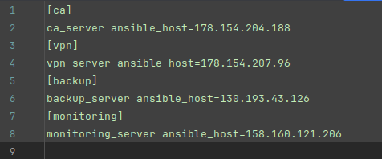
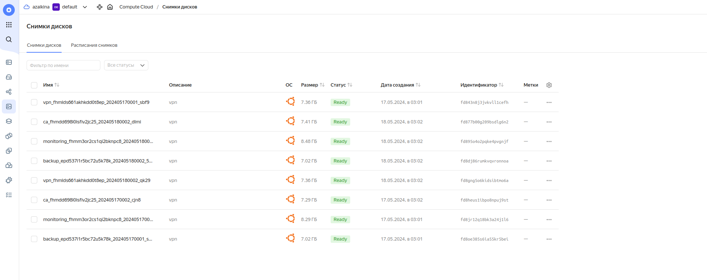

# Развёртывание VPN-инфраструктуры в Yandex Cloud

**Цель проекта**: создание стабильной и защищённой VPN-инфраструктуры для обеспечения безопасного удалённого доступа к
корпоративным ресурсам.

**Описание инфраструктуры** 
Проект включает в себя развёртывание четырёх виртуальных машин в Yandex Cloud для следующих целей:

- CA (Центр сертификации) - управление ключами и сертификатами для VPN;
- VPN сервер - обеспечение зашифрованного подключения к сети;
- Мониторинг - отслеживание состояния VPN-сервера и связанных с ним сервисов.
- Backup - резервное копирование важных данных.

**Технологический стек**

- Язык программирования: Python
- Yandex Cloud API
- Ansible для автоматизации задач
- Git для контроля версий
- Операционные системы: Ubuntu 22.04

**Процесс развёртывания**

1. **Создание виртуальных машин** 
   Виртуальные машины создаются в YandexCloud автоматически с помощью python-скрипта согласно предопределённой
   конфигурации,
   которая включает в себя параметры машины, такие как количество ядер, объём памяти и размер диска.
   Весь процесс ускоряется за счёт использования многопоточности. 

2. **Создание расписания снимков дисков в YandexCloud** 
   Автоматически создается расписание снимков дисков каждой машины, что позволяет обеспечить сохранность данных в случае
   сбоев или атак.

3. **Конфигурация систем** 
   С помощью Ansible автоматически запускается процесс установки и настройки необходимого программного обеспечения на
   машинах, что минимизирует возможность человеческой ошибки и гарантирует быструю и последовательную настройку всех
   машин.

## Создание виртуальных машин в YandexCloud

### Переменные окружения

До начала создания виртуальных машин в YandexCloud и их настройки, необходимо задать переменные окружения в
файле `.env`.

1. `USER`  
   **Описание**: имя пользователя, под которым будет выполняться авторизация на виртуальных машинах. 
   **Использование**: используется при настройке SSH-доступа и в Ansible для выполнения команд под данным
   пользователем.  

2. `AUTHORIZED_KEY_PATH`  
   **Описание**: путь к файлу JSON, содержащему ключи доступа для API Yandex Cloud. Этот файл используется для
   аутентификации запросов к Yandex Cloud API. 
   **Использование**: необходим для настройки SSH-доступа к машинам. Файл ключей используется для авторизации при
   выполнении операций через API.  

3. `FOLDER_ID` 
   **Описание**: идентификатор папки в Yandex Cloud, где будут создаваться виртуальные машины. 
   **Использование**: используется для указания рабочей области в Yandex Cloud API.  

4. `SSH_KEY_NAME` 
   **Описание**: имя SSH ключа. 
   **Использование**: используется для идентификации приватного и публичного ключей.  

5. `SSH_PRIVATE_KEY_PATH` и `SSH_PUBLIC_KEY_PATH` 
   **Описание**: пути к файлам приватного и публичного SSH-ключей. 
   **Использование**: приватный ключ используется для установления защищенного соединения управляющего компьютера с
   машинами в YandexCloud,
   публичный ключ записывается в их конфигурацию для обеспечения доступа.  

6. `YANDEX_EMAIL` 
   **Описание**: адрес электронной почты Yandex. 
   **Использование**: отправка электронных писем через SMTP сервер Yandex.  

7. `YANDEX_EMAIL_PASSWORD` 
   **Описание**: специальный пароль приложения, созданный в настройках учетной записи Yandex для использования в
   автоматизированных системах,
   отличный от основного пароля пользователя. 
   **Использование**: аутентификация при подключении к SMTP серверу Yandex для отправки электронных писем без
   использования основного пароля пользователя. Это повышает безопасность,
   так как специальный пароль можно отозвать в любой момент без изменения основного пароля.  

8. `MONITORING_PASSWORD` 
   **Описание**: пароль для доступа к системам мониторинга, устанавливаемым на машинах. 
   **Использование**: используется при настройке мониторинга для обеспечения безопасного доступа к интерфейсам
   мониторинга.

Переменные окружения загружаются в начале выполнения скрипта с помощью функции `load_dotenv()` из библиотеки `dotenv`.
Это позволяет изолировать чувствительные данные от кода и легко изменять параметры без необходимости изменения самого
кода.
Загруженные переменные используются по всему скрипту для конфигурации и авторизации, обеспечивая необходимую гибкость и
безопасность.

### SSH-ключ на управляющем компьютере

Для безопасного подключения управляющего компьютера к виртуальным машинам в YandexCloud необходимо сгенерировать новую
пару
SSH ключей (приватного и публичного).  
Создание ключей осуществляется с помощью метода `create_ssh_key` в классе `SSHKeys`.  
Метод сначала проверяет, существует ли приватный ключ по пути `~/.ssh/ИМЯ_КЛЮЧА.pub`. Имя ключа задается в файле `.env`.
Если файл ключа уже присутствует, функция уведомляет пользователя о том, что использование существующего ключа будет
продолжено, и новый ключ создаваться не будет.
Это предотвращает случайное перезаписывание уже используемых ключей.  

Если файл приватного ключа отсутствует, метод выполняет команду `ssh-keygen`.
При вызове `ssh-keygen` используются следующие параметры:

- -t rsa: указывает тип ключа RSA, который является общепринятым стандартом для SSH ключей.
- -b 4096: задаёт длину ключа в 4096 бит, что обеспечивает высокий уровень безопасности.
- -f </путь/до/приватного/ключа>: указывает путь, по которому будет сохранён новый приватный ключ.
- -N '': создаёт ключ без парольной фразы для упрощения автоматизации, не требуя ввода пароля при каждом использовании.
- -q: запускает команду в тихом режиме, уменьшая количество выводимых на экран сообщений.

После выполнения команды пользователю сообщается о создании нового ключа.

### Файл конфигурации виртуальных машин

Конфигурация виртуальных машин находится в файле `instances_config.py` в корневой папке проекта.
В файле конфигурации находится список словарей. Каждый словарь в этом списке содержит параметры для создания одной
виртуальной машины в Yandex Cloud.
В данной конфигурации определено четыре виртуальные машины, каждая из которых имеет уникальную роль и настройки.

**1. CA (Центр сертификации)**

- Особенности: машина, предназначенная для управления ключами и сертификатами для VPN.
- Параметры: 2 ядра CPU, 1 ГБ оперативной памяти, 10 ГБ дискового пространства.
- ОС: Ubuntu 22.04 с OsLogin.

**2. VPN сервер**

- Особенности: сервер для обеспечения зашифрованного доступа к корпоративной сети.
- Параметры: 2 ядра CPU, 1 ГБ оперативной памяти, 10 ГБ дискового пространства.
- ОС: Ubuntu 22.04 с OsLogin.

**3. Мониторинг**

- Особенности: машина для мониторинга состояния машин в инфраструктуре VPN.
- Параметры: 2 ядра CPU, 1 ГБ оперативной памяти, 10 ГБ дискового пространства.
- ОС: Ubuntu 22.04 с OsLogin.

**4. Backup (Резервное копирование)**

- Особенности: сервер для резервного копирования данных с машин CA и VPN.
- Параметры: 2 ядра CPU, 1 ГБ оперативной памяти, 10 ГБ дискового пространства.
- ОС: Ubuntu 22.04 с OsLogin.
- Расположена в другой зоне доступности для обеспечения георезервирования.

Каждая машина настроена для выполнения специфических задач, обеспечивающих безопасность и стабильность работы VPN-сети.

**Параметры конфигурации:**

- `name`: имя машины, используется для идентификации в облаке.
- `core_fraction`: процентное выражение загрузки ядра CPU.
- `cores`: количество ядер процессора.
- `memory`: объем оперативной памяти.
- `disk_size`: объем дискового пространства.
- `os`: версия операционной системы.
- `username`: имя пользователя для доступа.
- `zone_id`: зона доступности.
- `platform_id`: идентификатор платформы в Yandex Cloud.

Подробное описание параметров можно прочитать
в [документации](https://yandex.cloud/ru/docs/compute/api-ref/Instance/create).

### Процесс создания виртуальных машин

Для параллельного создания машин используется `ThreadPoolExecutor` из модуля `concurrent.futures`.
Этот подход позволяет одновременно запустить процессы создания нескольких виртуальных машин,
что значительно ускоряет общее время развертывания инфраструктуры.

**1. Инициализация Executor'а**
Используя контекстный менеджер, `ThreadPoolExecutor` инициализируется как `executor`.
Это создает пул потоков, в котором будут выполняться задачи по созданию виртуальных машин.

**2. Отправка задач на выполнение**
Для каждой машины из `INSTANCES_CONFIG` скрипт отправляет задачу на создание виртуальной машины в пул потоков.
Метод `executor.submit()` вызывается с параметрами каждой виртуальной машины (имя, конфигурация ядер, память, размер
диска, ОС, имя пользователя, зона доступности и идентификатор платформы).
Задачи ассоциируются с именами машин для дальнейшей идентификации.

**3. Обработка результатов выполнения**
По мере завершения задач `concurrent.futures.as_completed(future_to_instance)` обеспечивает итерацию по результатам
каждой операции.
Если задача выполнена успешно, скрипт извлекает IP-адрес из результата и сохраняет его в словарь `instance_data`,
регистрируя успех создания машины и её адрес.
В случае ошибок в процессе создания машины, скрипт выводит, возникшие исключения.

По завершении всех операций скрипт выводит итоговый список IP-адресов виртуальных машин.

Непосредственное создание виртуальных машин осуществляется с помощью YandexCloud API.
За настройку и запуск виртуальной машины в YandexCloud отвечает метод `setup_instance` класса `Instances`.
Он выполняет следующие ключевые шаги:

**1. Проверка существования машины** 
Метод сначала проверяет, существует ли уже машина с указанным именем (name).
Это делается вызовом метода `get_instance_by_name`.
Если машина существует, метод извлекает и возвращает IP-адрес этой машины, предотвращая попытку создание дубликата.

**2. Создание новой машины** 
Если машина с указанным именем не найдена, метод вызывает `create_instance`, передавая все необходимые параметры,
такие как количество ядер (cores), объем памяти (memory), размер диска (disk_size), операционную систему (os) и другие.

Для безопасного доступа к создаваемой машине, метод `create_instance` сначала читает публичный SSH ключ с управляющей
машины
с помощью вызова `SSHKeys().read_public_key()`. Далее создается строка конфигурации пользовательских данных.
Создается строка конфигурации в формате #cloud-config, которая указывает имя пользователя, его права, используемую
оболочку и авторизованные SSH ключи.
Это обеспечивает предварительную настройку пользователя при первом запуске машины, включая права суперпользователя без
запроса пароля.

Также метод `create_instance` определяет идентификатор подсети (subnet_id), который соответствует зоне,
указанной в параметрах (zone_id), с использованием `Subnets().get_subnet_id_by_zone(zone_id)`.

Далее метод `create_instance` выбирает идентификатор образа операционной системы (image_id)
с учетом требований к размеру диска и описания ОС.

Формируется сложный JSON-объект payload, который содержит все необходимые параметры для создания машины,
включая идентификатор папки, спецификации сетевых интерфейсов, ресурсов, дисков и пользовательские метаданные.
В метаданные включается не только пользовательская конфигурация, но и данные для SSH доступа, что обеспечивает
возможность удаленного управления машиной.

Запрос отправляется через API клиент (self.session.post), который обращается к endpoint Yandex Cloud для создания
инстанса.
По ответу API метод извлекает и возвращает идентификатор созданной машины (instance_id), который может быть использован
для дальнейшего управления машиной или получения ее статуса.

**3. Ожидание запуска машины** 
После создания машины вызывается метод `wait_for_instance_running`, который циклически проверяет статус машины до тех
пор,
пока она не перейдет в состояние "RUNNING". Этот метод также отвечает за получение и возврат IP-адреса запущенной
машины.

**4. Обработка исключений** 
Если в процессе создания или ожидания запуска машины возникают ошибки, метод генерирует исключение с соответствующим
сообщением об ошибке.

_Созданные виртуальные машины в YandexCloud_

### Создание файла инвентаря для Ansible

После успешного создания виртуальных машин, следующий важный шаг в развертывании инфраструктуры - создание файла
инвентаря для Ansible.
Этот файл используется для управления конфигурациями и автоматизации задач на виртуальных машинах.
Файл инвентаря Ansible (`ansible/inventory/hosts`) содержит информацию о всех узлах (виртуальных машинах),
которыми управляет Ansible. В нем указываются IP-адреса машин, что позволяет Ansible корректно идентифицировать и
управлять каждым узлом в сети.

**Процесс создания файла:**

1. Функция `create_instance` возвращает словарь `instance_ips`, содержащий имена и IP-адреса созданных машин.
2. Функция `write_inventory`, в которую передаются данные созданных машин, инициирует путь к директории инвентаря,
   используя переменную
   `PROJECT_ROOT`, которая указывает на корневую директорию проекта.
3. С помощью `os.makedirs(inventory_path, exist_ok=True)` проверяется существование директории. Если директорию
   отсутствует,
   то происходит ее создание.
4. В файл hosts в директории инвентаря записываются имена и IP-адреса в формате, который Ansible может интерпретировать
   для выполнения операций.
   После записи данных в файл, функция выводит путь к файлу `hosts`.

Файл `hosts` не сохраняется в удаленном репозитории. Для этого в файл `.gitignore` добавляется соответствующая запись,
исключающая файл `hosts`.

_Файл инвентаря `hosts`_

### Создание расписания снимков дисков в Yandex Cloud

После развертывания виртуальных машин следующий этап - настройка автоматического создания снимков их дисков.
Снимки дисков (snapshots) позволяют восстановить состояние виртуальной машины на момент создания снимка,
что критически важно для восстановления после сбоев или атак.

**Процесс настройки включает несколько ключевых шагов:**

1. Определение необходимых дисков. 
   Из конфигурации INSTANCES_CONFIG собирается список всех виртуальных машин, для которых нужно создать расписание
   снимков.
   Для каждой машины по её идентификатору находятся связанные с ней диски, используя API запросы к Yandex Cloud.
2. Формирование списка дисков для снимков. 
   Полученные идентификаторы дисков собираются в список, который будет использоваться для создания расписания снимков.
3. Создание расписания снимков. 
   Для создания расписания снимков используется функция `create_snapshot_schedule`, которая настраивает параметры
   расписания:

- name и description - название и описание расписания, чтобы его можно было легко идентифицировать.
- schedule_expression - выражение cron, определяющее частоту создания снимков (например, ежедневно в полночь).
- max_snapshots_to_keep - максимальное количество снимков, которые нужно хранить, чтобы избежать излишнего использования
  дискового пространства.

4. Активация расписания. 
   После создания расписания необходимо убедиться, что оно активировано.
   Выполняется периодическая проверка статуса расписания до момента, когда оно перейдет в состояние "ACTIVE".

В случае возникновения проблем при создании или активации расписания, программа выведет сообщение об ошибке.

_Созданное расписание снимков дисков в YandexCloud_

_Сохраненные снимки дисков_

## Настройка виртуальных машин

Для автоматизации настройки виртуальных машин в проекте используется Ansible.
Этот инструмент позволяет автоматически устанавливать необходимое программное обеспечение и настраивать системы,
гарантируя, что все машины настроены правильно и единообразно. Это значительно упрощает процесс управления
серверами и сокращает время, необходимое на ручную настройку.

Для завершения процессов создания машин и обеспечения того, чтобы все машины были полностью доступны для управления
через Ansible
в скрипте предусмотрен 60-секундный интервал ожидания.
После паузы в 60 секунд после создания машин и расписания снимков скрипт выполняет функцию `run_ansible()`, которая
запускает Ansible playbook.
Этот playbook содержит ряд задач, которые настраивают машины, устанавливают необходимое программное обеспечение и
конфигурируют сервисы в соответствии с требованиями проекта.

**Ключевые аспекты функции `run_ansible()`:**

1. Передача переменных. 
   В функцию включен список `extra_vars`, который содержит переменные, необходимые для работы playbook.
   Эти переменные считываются из файла `.env` и передаются непосредственно в Ansible через командную строку.
   Переменные включают:

- ansible_ssh_user: имя пользователя для SSH доступа.
- ansible_ssh_private_key_file и ansible_ssh_public_key_file: пути к приватному и публичному ключам SSH.
- local_host_ip: IP-адрес управляющего узла.
- yandex_email и yandex_email_password: данные для доступа к почтовому серверу Yandex.
- monitoring_password: пароль для системы мониторинга, который может потребоваться для настройки соответствующих
  сервисов.

2. Формирование строки переменных. 
   Переменные формируются в строку `extra_vars_string` с использованием функции `shlex.quote`,
   которая обеспечивает корректное экранирование специальных символов в UNIX/Linux системах.
   Это предотвращает потенциальные проблемы при интерпретации аргументов командной строки.

3. Запуск playbook. 
   Скрипт использует `subprocess.run` для запуска команды ansible-playbook, передавая путь к playbook файлу (
   playbook.yml)
   и сформированную строку переменных.
   Использование ключа check=True гарантирует, что в случае возникновения ошибки в процессе выполнения playbook,
   скрипт завершится с исключением, что позволяет быстро реагировать на возникшие проблемы.

### Файл конфигурации Ansible `ansible.cfg`

`ansible.cfg` - конфигурационный файл, который настраивает основные параметры Ansible.

`[defaults]` - основная секция для установки стандартных настроек Ansible.

1. `inventory = ansible/inventory` - путь к файлу инвентаря, указывающему на хосты для управления.
2. `roles_path = ansible/roles` - директория, где Ansible будет искать роли. Роли Ansible - это предварительно
   заданные блоки задач, которые можно повторно использовать для автоматизации задач на разных хостах.
3. `host_key_checking = false` - отключение проверки SSH ключей хоста для упрощения первого подключения.
4. `nocows = 1` - отключение пасхалки Ansible, которая показывает сообщения с ASCII-графикой коровы, если на компьютере
   установлены соответствующие программы (например, cowsay).

### Директория `inventory` в Ansible

Директория `inventory` является центральным хранилищем для управления информацией о хостах, которыми Ansible должен
управлять. В этой директории содержатся файлы, определяющие хосты и группы хостов, а также их переменные. Она играет
важную роль в структурировании и организации всех управляемых серверов, что позволяет Ansible понимать,
какие действия и на каких хостах нужно выполнять.

**Ключевые компоненты директории `inventory`:**

1. Файл `hosts`. 
   Это основной файл инвентаря, где перечислены все хосты и группы хостов.
   В нем указываются IP-адреса или имена хостов, которые Ansible будет использовать для подключения и выполнения задач.
   В проекте этот файл создается автоматически в процессе создания виртуальных машин в YandexCloud с помощью
   python-скрипта.
2. Директория `group_vars`. 
   Содержит файлы переменных, которые применяются к различным группам хостов.
   Один из таких файлов - `all.yml`, который
   включает переменные, применяемые ко всем хостам.
   В этих файлах определяются параметры, такие как настройки сетевых портов, конфигурации SSH, пути к файлам и
   директориям, а также специфичные настройки для определенных приложений или сервисов.

### Директория `playbooks` в Ansible

Директория `playbooks` в структуре Ansible содержит playbook-файлы - основные исполняемые сценарии, которые описывают,
какие задачи Ansible должен выполнить на одном или нескольких хостах. Эти файлы организуют и документируют процессы
автоматизации, делая их воспроизводимыми и легко настраиваемыми.