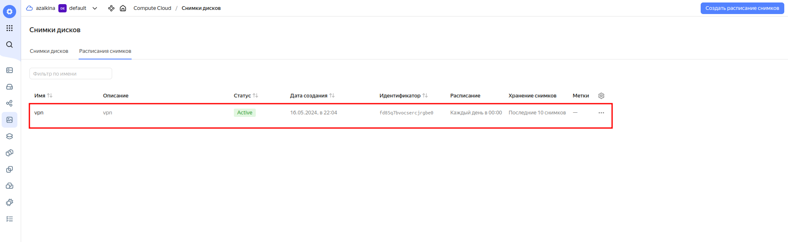
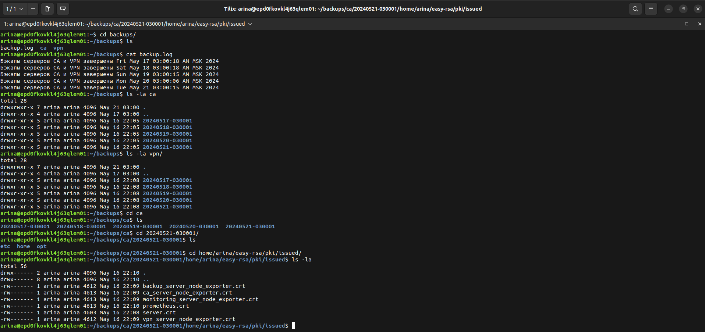

# Результаты

## Схема VPN-инфраструктуры

## Созданные виртуальные машины в YandexCloud

## VPN
### Создание файла конфигурации VPN_

### Файл конфигурации, отправленный на почту_

### Подключение к VPN

## Мониторинг

### Веб-интерфейс Prometheus https://158.160.121.206:9090/

#### Авторизация

#### Экспортеры

#### Алерты

#### Уведомления на почту о алертах

### Веб-интерфейс Grafana https://158.160.121.206:3000/

#### Авторизация

#### Дашборд

## Бэкапирование и резервирование

### Созданное расписание снимков дисков в YandexCloud

### Сохраненные снимки дисков

### Резервные копии файлов на сервере backup

### Уведомление на почту о создании резервных файлов

### Репозиторий с DEB-пакетами https://github.com/arinazaikina/azaikina-deb-repo

